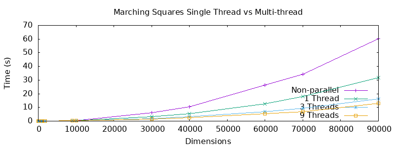

# README

### Marching Squares

### Installation / Usage

1. Clone this repository
2. `./test.sh` to run tests and compile


### Description

#### Implementation

##### Single-Threaded

The single threaded version of the program had to be looked at from a different perspective than usual. The `msquare_1bit` method was relatively simple and involved looping through in row major order and setting each value to either one of `0x00` or `0xFF` based on whether it is greater or lower than the threshold. This involved a double for loop and would run in $O(mn) $time. In this method a new image would be returned which contained all these new cell values, with either `0x00` and `0xFF`. 

In the detect method we then loop through all of the cells and scan across a 3 by 3 segment. Note that this specific method does not deal with cells that do not fit snugly into the window. However, it does not parse the end of the rows that do not fit into a 3 by 3 window e.g. 5 by 5 grid will only effectively have one window parsed. During the loop we take advantage of loop unrolling rather than inserting an inner for loop.

The fill method is probably the most unique out of the three as it attempts to ensure that we adhere to the row major order of C. A naive implementation by me before knowing about row major order would have rushed in and scanned columns as 3 by 3 blocks. Instead, for each row they would retrieve the segment and then use the map of matrix values defined in order to set the cell value to the given positive or negative value. This ensured that when looping through each cell value would be accessed in a row by row order and hence improved performance sufficiently.


##### Multi-threaded Solution

The multi-threaded solution transitioned quite smoothly from the single threaded implementation. It mainly required a way to separate the cells into divisible components that each thread could take without issues of false sharing. The way this was done was by:

```java
// Get the amount of rows for each thread
size_t thread_rows = height/( 3 * N_THREADS );
```

This is the amount of rows each thread would take, with the final thread taking a possible larger amount due to not being able to complete divide the height into a whole value. A struct was necessary in order to pass the thread data around for each thread:

```c
struct thread_data {
        uint8_t* input_image;
        uint8_t in_width;
        uint8_t in_height;
        uint8_t threshold;
        uint8_t* new_image;
        size_t start_index;
        size_t end_index;
        uint8_t pos_colour;
        uint8_t neg_colour;
        uint8_t* segments;
        uint8_t segment_length;
    	uint8_t** matrix_map;
};
```

As shown above each thread would need a `start_index` and an `end_index` to know which rows it should start and end at:

```c
data[i].start_index = i * thread_rows * 3;
data[i].end_index = (i + 1) * thread_rows * 3;
```

This allows each thread to have chunks of row triplets which are essential for the multi-threaded implementation, and especially to avoid false sharing wherein we have one thread changing data for another. This would cause sufficient performance decreases and was avoided. Every method was slightly changed to include these two parameters, and loop correctly within the specified bound. But generally the operation of each method was similar to the single threaded approach. 


### Performance

The performance results of the multi-threaded solution were quite surprising as they were much quicker than anticipated.

For the single threaded solution:

```
Test Single Thread: 10000by10000.in
real	0m0.621s
user	0m0.588s
sys		0m0.032s

Test Single Thread: 15by15.in

real	0m0.001s
user	0m0.001s
sys		0m0.000s

Test Single Thread: 1800by1800.in
real	0m0.030s
user	0m0.027s
sys		0m0.003s

Test Single Thread: 30000by30000.in
real	0m6.252s
user	0m5.879s
sys		0m0.357s

Test Single Thread: 40000by40000.in
real	0m10.379s
user	0m9.770s
sys		0m0.591s

Test Single Thread: 60000by60000.in
real	0m26.838s
user	0m25.291s
sys		0m1.475s

Test Single Thread: 70000by70000.in
real	0m34.814s
user	0m32.612s
sys		0m2.121s

Test Single Thread: 810by810.in
real	0m0.006s
user	0m0.005s
sys		0m0.001s

Test Single Thread: 81by81.in
real	0m0.001s
user	0m0.000s
sys		0m0.000s

Test Single Thread: 90000by90000.in
real	1m0.383s
user	0m56.444s
sys		0m3.797s

Test Single Thread: 9000by9000.in
real	0m0.518s
user	0m0.485s
sys		0m0.032s

Test Single Thread: 900by900.in
real	0m0.007s
user	0m0.006s
sys		0m0.000s
```


As we can see for the 70000 by 70000 test the performance was extremely poor taking approximately 34 seconds.


However for the parallel threads with 1 threads gave expected results akin to the single threaded solution:

```
Dimensions     Multi-Threaded(1) 
15x15           0.001                           
81x81           0.001                   
810x810         0.004
900x900         0.001
1800x1800       0.019
9000x9000       0.233
10000x10000     0.277
30000x30000     3.111
40000x40000     5.520
60000x60000     12.739
70000x70000     17.941
90000x90000     31.668
```


For 3 threads, this exhibited an expected increase in performance approximately relatively to the above example. However as we will see with 9 threads below performance begins to dip as the number of threads increase beyond a certain limit:

```
Test Parallel: 10000by10000.in
real	0m0.207s
user	0m0.440s
sys		0m0.080s

Test Parallel: 15by15.in
real	0m0.001s
user	0m0.000s
sys		0m0.001s

Test Parallel: 1800by1800.in
real	0m0.014s
user	0m0.030s
sys		0m0.004s

Test Parallel: 30000by30000.in
real	0m1.750s
user	0m3.908s
sys		0m0.597s

Test Parallel: 40000by40000.in
real	0m3.144s
user	0m6.863s
sys		0m1.130s

Test Parallel: 60000by60000.in
real	0m6.944s
user	0m15.393s
sys		0m2.413s

Test Parallel: 70000by70000.in
real	0m9.362s
user	0m21.003s
sys		0m3.173s

Test Parallel: 810by810.in
real	0m0.003s
user	0m0.007s
sys		0m0.001s

Test Parallel: 81by81.in
real	0m0.001s
user	0m0.001s
sys		0m0.000s

Test Parallel: 90000by90000.in
real	0m16.372s
user	0m35.773s
sys		0m5.768s

Test Parallel: 9000by9000.in
real	0m0.183s
user	0m0.359s
sys		0m0.083s

Test Parallel: 900by900.in
real	0m0.004s
user	0m0.008s
sys		0m0.002s
```


And for 9 threads we see a further decrease in times:

```
#Dimensions Times Multi-Threaded(9) Times
15x15           0.001   
81x81           0.001   
810x810         0.003
900x900			0.004
1800x1800       0.013
9000x9000       0.237
10000x10000     0.324
30000x30000     1.299
40000x40000     2.576
60000x60000     5.361
70000x70000     6.901
90000x90000     12.911

```


**What was very interesting to note was that by making matrix_map a static or global variable we saw a sufficient increase in performance. The below times show speeds by using a static matrix_map.**

```
Test Single Thread: 10000by10000.in
real	0m0.530s
user	0m0.485s
sys		0m0.044s

Test Single Thread: 15by15.in
real	0m0.001s
user	0m0.000s
sys		0m0.000s

Test Single Thread: 1800by1800.in
real	0m0.017s
user	0m0.015s
sys		0m0.002s

Test Single Thread: 810by810.in
real	0m0.004s
user	0m0.004s
sys		0m0.000s

Test Single Thread: 81by81.in
real	0m0.000s
user	0m0.000s
sys		0m0.000s

Test Single Thread: 70000by70000.in
real	0m26.252s
user	0m24.628s
sys		0m1.099s

Test Single Thread: 9000by9000.in
real	0m0.425s
user	0m0.391s
sys		0m0.032s

Test Single Thread: 900by900.in
real	0m0.005s
user	0m0.004s
sys		0m0.001s

Test Single Thread: 40000by40000.in
real	0m8.075s
user	0m7.591s
sys		0m0.473s
```

```
Test Parallel: 10000by10000.in
real	0m0.277s
user	0m0.224s
sys		0m0.052s

Test Parallel: 15by15.in
real	0m0.001s
user	0m0.000s
sys		0m0.000s

Test Parallel: 1800by1800.in
real	0m0.019s
user	0m0.017s
sys		0m0.002s

Test Parallel: 30000by30000.in
real	0m2.443s
user	0m2.077s
sys		0m0.361s

Test Parallel: 40000by40000.in
real	0m4.352s
user	0m3.680s
sys		0m0.666s

Test Parallel: 810by810.in
real	0m0.004s
user	0m0.003s
sys		0m0.001s

Test Parallel: 81by81.in
real	0m0.001s
user	0m0.000s
sys		0m0.000s

Test Parallel: 90000by90000.in
real	0m24.668s
user	0m20.728s
sys		0m3.714s

Test Parallel: 9000by9000.in
real	0m0.233s
user	0m0.190s
sys		0m0.043s

Test Parallel: 900by900.in
real	0m0.005s
user	0m0.004s
sys		0m0.001s
```


As we can see from the plot below, single threaded and multi-threaded times are compared:

